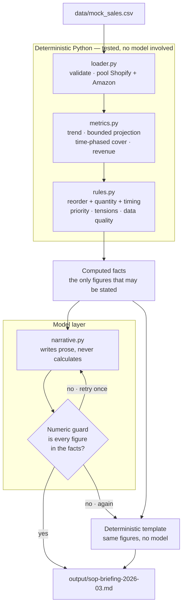
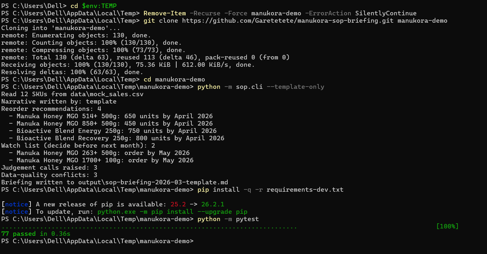

# Monthly S&OP Briefing Automation

[](https://github.com/Garetetete/manukora-sop-briefing/actions/workflows/ci.yml)

Turns a monthly sales and inventory extract into a briefing a non-technical executive can read in
five minutes and act on: what changed, what is at risk, what to do next.

**[Read the generated briefing →](output/sop-briefing-2026-03.md)** — no setup required.
Written by `gemini-3.1-pro-preview`. The
[template-rendered version](output/sop-briefing-2026-03-template.md) is committed beside it, so
the two paths can be compared.

**[Part 2: Morning Intelligence Brief architecture →](docs/part2-morning-intelligence-brief.md)**

---

## The design decision everything rests on

> **Arithmetic is deterministic Python. The model only writes prose.**

Demand, trend, cover, revenue opportunity, reorder quantity and priority are all computed in
tested Python and handed to the model as fact. The model is never asked to calculate.

Then the output is checked rather than trusted: every number in the returned narrative is matched
against the computed set. An invented figure triggers one corrective retry, then falls back to a
deterministic template rather than shipping a briefing that reads well and is wrong.

Three things follow from this. The output is **verifiable** — every figure traces to a formula
with a test. The system **works without a model**, so the full analysis runs with no API key and
no network. And a model failure **degrades** instead of breaking.

## How it flows



The template is not a stub. It is a full second path to the same briefing, held to the same
numeric standard by the same test, which is what makes `--template-only` a real mode rather than
a degraded one.

## Why this is a Python CLI and not an n8n workflow

Manukora runs on n8n, so the choice deserves a reason rather than a preference.

**n8n earns its place in orchestration**: maintained connectors for Shopify, Amazon SP-API, Cin7,
Klaviyo, Gorgias and Slack, with OAuth, pagination and rate limits handled; scheduling, retries
and alerting as infrastructure instead of code; and a run history someone outside engineering can
read and re-run. That is exactly how [Part 2](docs/part2-morning-intelligence-brief.md) proposes
building the daily brief.

**It is the wrong home for this part.** The work here is business logic — a month-by-month
inventory simulation, per-SKU policy exceptions, revenue ranking, and a numeric guard on the
model's output. In n8n that becomes JavaScript inside code nodes: no unit tests, no meaningful
diffs, nothing reusable. The brief asks how the maths and the output were verified, and a canvas
cannot be tested.

So: **n8n orchestrates, Python decides.** Fetching, scheduling, delivery and retries belong to
the workflow engine; computation and correctness belong in tested code. The two parts of this
submission are the same argument seen from both ends.

## What it produces

From the twelve-SKU extract it flags four reorders, ranked by revenue at stake:

| # | SKU | Order | By | Cover | Revenue at stake |
|---|---|---:|---|---:|---:|
| 1 | MGO 514+ 500g | 650 units | April 2026 | 1.75 mo | $34,316/mo |
| 2 | MGO 850+ 500g | 450 units | April 2026 | 1.58 mo | $29,477/mo |
| 3 | Bioactive Blend Energy 250g | 750 units | April 2026 | 1.62 mo | $17,396/mo |
| 4 | Bioactive Blend Recovery 250g | 800 units | April 2026 | 1.42 mo | $16,476/mo |

Plus two watch items that need a decision before next month, three judgement calls, and three
data-quality conflicts it refused to resolve silently.

## Four decisions worth explaining

**Cover is simulated, not divided.** Both obvious shortcuts are wrong, in opposite directions.
`stock / monthly_demand` ignores stock already in transit. `(stock + units_on_order) /
monthly_demand` credits it as if it were on the shelf today. And both assume demand stays flat
while every SKU here grows between 3.9% and 13.2% a month.

Cover is instead walked forward month by month, crediting an inbound order only in the month it
lands. **This changes answers in both directions.** MGO 1700+ reads as short on stock alone —
840 units against 300 a month is 2.80 months against a three-month target — but 400 units arrive
in month two, so real cover is 3.35 and no order is due. Read the other way, `(840 + 400) / 300`
gives 4.13 months and hides that the SKU still needs a decision before June. The simulation gives
3.35 and puts it on the watch list. That case is a named test.

**`Order_Arrival_Months = 0` means no order exists.** Six of the twelve rows carry it. Read as an
immediate arrival it inflates every cover figure that depends on it, and nothing errors. There is
a deliberate contrast test showing the naive formula returning 52 months of cover where the honest
one returns under 3.

**Target cover is read per SKU.** MGO 1700+ targets three months, not two. Hard-coding two would
quietly mis-handle the premium line, so a test asserts the target actually drives the decision.

**A discontinued line is not restocked on autopilot.** Propolis is being phased out in Q2 2026 and
sits at 1.20 months of cover — above its 30-day floor, so it is flagged and not reordered. It is
also the fastest-growing SKU in the range at +40%, which the briefing raises as a question for the
business rather than resolving.

## Running it

Python 3.11+. No database, no containers, no credentials required.

```bash
git clone https://github.com/Garetetete/manukora-sop-briefing.git
cd manukora-sop-briefing
python -m sop.cli --template-only
```

That is the whole setup. **No dependencies, no virtualenv, no API key, no network** — the
deterministic path uses only the standard library, and it writes the full briefing to `output/`.



The analysis runs before anything is installed. `pip install` appears only because the test suite
needs pytest.

### Bring your own model

To have the narrative written by a model, install one SDK and set one key. The provider is
detected from whichever credential is present, so there is nothing else to configure.

```bash
pip install google-genai        # or: anthropic  /  openai
export GEMINI_API_KEY=...       # free key at aistudio.google.com
python -m sop.cli
```

| Provider | Install | Credential | Default model |
|---|---|---|---|
| Gemini | `google-genai` | `GEMINI_API_KEY` | `gemini-3.1-pro-preview` |
| Gemini on Vertex AI | `google-genai` | `GCP_PROJECT` + application default credentials | `gemini-3.1-pro-preview` |
| Claude | `anthropic` | `ANTHROPIC_API_KEY` | `claude-sonnet-5` |
| GPT | `openai` | `OPENAI_API_KEY` | `gpt-4o` |
| None | — | — | deterministic template |

`SOP_MODEL` overrides the model for any provider. `SOP_PROVIDER` forces a specific one instead of
auto-detecting. `OPENAI_BASE_URL` points the OpenAI adapter at any compatible gateway.
`GCP_LOCATION` defaults to `global`, because Gemini 3.x is not served from regional endpoints.

Nothing outside `narrative.py` knows which vendor is in use. Providers are duck-typed against a
one-method interface, which is why the test suite substitutes a fake and why a missing SDK or a
bad key degrades to the template instead of failing the run.

The briefing committed in `output/` was generated with `gemini-3.1-pro-preview` through Vertex AI.

`--template-only` skips the model entirely. The output is the same figures rendered
deterministically, and it is held to the same numeric standard by the same test.

## Tests

**77 tests, no network, no credentials, no database.** CI runs them on Linux, macOS and Windows,
against Python 3.11 and 3.12.

```bash
pip install -r requirements-dev.txt
python -m pytest
```

Organised by requirement of [`SPEC.md`](SPEC.md), which was written before the code, so the trace
from specification to implementation to proof is explicit.

| File | Covers |
|---|---|
| `test_req_001_002_loading.py` | Validation, rejection of malformed input, pooled channel demand |
| `test_req_003_004_trend_projection.py` | Launch-date exceptions, channel divergence, bounded projection |
| `test_req_005_006_cover_policy.py` | Time-phased cover, the `0` arrival trap, per-SKU targets, phase-out |
| `test_req_007_008_priority_reorder.py` | Revenue ranking, tensions, quantity and order-by timing |
| `test_req_009_data_quality.py` | Detecting the launch-date contradiction |
| `test_req_010_011_012_narrative.py` | Numeric guard, retry, fallback, CLI |

Three bugs were found by these tests rather than by reading code, including two cases where my own
assumption was wrong and the implementation was right. All three, and three further defects found
by other means, are written up in [`docs/prompt-log.md`](docs/prompt-log.md).

## Prompting and AI usage

Full detail, including where the AI was wrong, is in
[`docs/prompt-log.md`](docs/prompt-log.md). In short:

**The first instruction I tried** was the obvious one — paste the CSV, ask for a briefing:

```
Write a monthly S&OP briefing for a non-technical executive from the data below.
Cover what sold well, what is at risk, and what to reorder. Explain your reasoning.
[CSV pasted]
```

It read fluently and could not be trusted. Cover ratios that did not reconcile, and units on
order treated as stock in hand.

**What the system actually uses** is in [`sop/narrative.py`](sop/narrative.py): a rule that the
model may only restate figures given to it, seven named sections, and a FACTS block containing
computed performance, near-term risk, capital tied up, the watch list, ranked recommendations,
judgement calls and data-quality conflicts.

**What changed and why.** The model stopped calculating — that is the whole design, not a prompt
tweak. Its output is checked rather than trusted. Risk was scoped to three months after the first
real run listed stockouts twelve months out. And overstock became a computed field because the
model inferred it unprompted; rather than delete a fair observation, I gave it a number.

**Where the AI was wrong.** Six defects are written up. The most useful: two of my own test
assertions were wrong while the code was right, and the run command in an earlier version of this
README did not work from a clean clone — the suite had passed throughout, because only using the
artifact the way a stranger would could catch it.

## How verification was done

Beyond the suite: the deterministic template is held to the same numeric guard as the model by
a test, so the fallback cannot drift; the generated briefing is re-checked against the computed figures
after every run; and the reorder arithmetic was reproduced by hand against the extract before the
thresholds were fixed.

## Layout

```
SPEC.md                     twelve numbered requirements, written before the code
data/mock_sales.csv         the supplied extract
output/                     the generated briefing, committed
docs/
  prompt-log.md             prompt v1 to v2, and where the AI was wrong
  assumptions.md            every judgement call, and what the extract lacks
  part2-...md               Morning Intelligence Brief architecture
tests/                      77 tests, one module per requirement
sop/
  policy.py                 business exceptions, declarative and in one place
  loader.py                 read and validate; refuses to guess
  metrics.py                trend, projection, cover, revenue — no AI
  rules.py                  reorder decisions, priority, tensions, data quality — no AI
  narrative.py              the only layer that talks to a model
  cli.py                    entry point
```

Full reasoning for every assumption is in [`docs/assumptions.md`](docs/assumptions.md).
