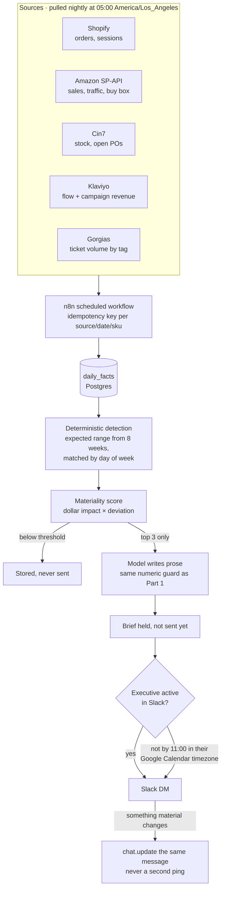

# Part 2 — Morning Intelligence Brief

## What I would build

A daily Slack direct message, under 200 words, naming at most three things and why each matters.
Not a dashboard link, not a digest of everything that moved. If nothing crosses the materiality
bar, it says so in one sentence. "Nothing needs you today" is a feature: it is
what makes the other days credible.

## How it works

**Ingest, 05:00 America/Los_Angeles.** An n8n schedule pulls the previous complete day from
Shopify (Orders and Reports GraphQL), **Amazon Seller Central** (SP-API sales and traffic),
**Cin7** (stock and open POs), **Klaviyo** (flow and campaign revenue) and **Gorgias** (tickets by
tag), into a `daily_facts` table in Postgres keyed by `(source, date, sku)` with an idempotency
key, so a replayed webhook or a re-run never double-counts.

**Detect, deterministically.** A Python service compares each metric against an expected range
built from the trailing eight weeks, matched by day of week so a normal Sunday dip never fires.
Every candidate is classified into one of three kinds, because they are different questions and
an executive reads them differently:

- **Changed overnight** — one period outside its expected range: revenue, units, conversion,
  refunds, Amazon buy-box share, a spike in Gorgias tickets under one tag.
- **Trending the wrong way** — sustained drift, not a blip: three consecutive days below the
  expected range, or a negative rolling slope over fourteen. A dip that recovers never reaches the
  brief; a slow slide no single day would flag does.
- **Needs a decision today** — anything with a deadline. Stock cover falling inside supplier lead
  time, so an order placed tomorrow is already late. A promotion ending. A suppressed Amazon
  listing. These lead the brief even at smaller value, because the other two can wait a day.

Each candidate gets a materiality score: estimated dollar impact multiplied by how far it sits
outside the expected range, with decision-deadline items weighted up. Anything below the
threshold is stored but never sent.

**Write.** The top three go to the model with their computed figures and the same rule as Part 1:
it writes prose and never produces a number, and the output is checked before it leaves the
system. **Deliver** as a Slack DM: the team is already there, and it allows edit-in-place.

## The timing problem

I would not try to guess when the executive wakes up. Inferring location from IP or reading a
phone's activity is the creepy option; a learned model of their waking hours is the overbuilt one,
solving a scheduling problem with machine learning. Both are also fragile.

Instead: **generate once, deliver on first contact.** The brief is produced at a fixed data cutoff
and held. n8n subscribes to Slack's `user_change` presence event and posts the moment the
executive first becomes active, wherever they are. If they have not appeared by a configurable
hour — say 11:00 in the timezone their **Google Calendar** reports, which travels with them — it
sends anyway.

They control two settings: a preferred delivery hour and a quiet window it must not breach. If
something material lands after sending, we **edit the existing message** with `chat.update` rather
than pinging twice. One message a day, always in the same place.

## Keeping it useful instead of noisy

The hard cap of three is the main defence. Beyond it: same-issue suppression, so a signal that
fired yesterday returns only if it worsens by a set margin; seasonality-aware baselines; and a
👍/👎 reaction logged per signal, with a monthly review raising the threshold on anything
consistently ignored. The system should get quieter over time, not louder.

## Failure modes

The worst is **silent partial data**. If Amazon's report is late, the brief must say "Amazon figures unavailable, totals exclude Amazon" rather than quietly reporting a 30% drop
that is really a missing file. Every source carries a freshness stamp, and a stale source becomes
a caveat line, not a hidden gap.

Then: **a job that never runs** — a dead-man's switch posts to an ops channel if nothing is
published by 12:00 PT. **Rate limits**, handled by nightly batch reads with backoff rather than
live queries. **DST**, handled by storing UTC and rendering in the recipient's calendar timezone.
And **model failure**, covered by the template fallback above.

## Rough operating cost

At Manukora's scale the AI is the cheapest part. One brief a day is roughly 6k input and 600
output tokens: under **$1 a month** on Gemini Flash, under $5 on a Pro model. The real cost is
infrastructure — n8n and a small Postgres instance, about **$40–70 a month**. Source APIs come
with subscriptions Manukora already pays for.

Call it **under $75 a month**, dominated by hosting, which leaves room to run the stronger model
for the writing step.
