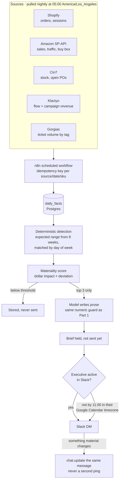

# Part 2 — Morning Intelligence Brief

## What I would build

A daily Slack direct message, under 200 words, naming at most three things that need the
executive's attention and one line on why each matters. Not a dashboard link, not a digest of
everything that moved. If nothing crosses the materiality bar, the brief says so in one sentence.
"Nothing needs you today" is a feature: it is what makes the other days credible.

## How it works

**Ingest, 05:00 America/Los_Angeles.** n8n runs a scheduled workflow that pulls the previous
complete day from Shopify (Orders and Reports GraphQL), **Amazon Seller Central** (SP-API sales
and traffic reports), **Cin7** (stock on hand and open purchase orders), **Klaviyo** (flow and
campaign revenue), and **Gorgias** (ticket volume and tags). Each source writes into a
`daily_facts` table in Postgres, keyed by `(source, date, sku)` with an idempotency key so a
replayed webhook or a re-run never double-counts.

**Detect, deterministically.** A Python service compares each metric against an expected range
built from the trailing eight weeks, matched by day of week so a normal Sunday dip never fires.
Candidate signals: revenue and units versus expected, conversion rate, refund rate, Amazon
buy-box loss, stock cover crossing a target, ad-driven traffic without matching orders, and a
spike in Gorgias tickets carrying a specific tag. Each candidate gets a materiality score:
estimated dollar impact multiplied by how far it sits outside the expected range. Anything below
the threshold is stored but never sent.

**Write.** The top three candidates go to Gemini with their computed figures and the same rule
used in Part 1: the model writes prose and never produces a number. The output is checked against
the computed values before it leaves the system; if it invents a figure, the brief falls back to a
deterministic template rather than going out wrong.

**Deliver.** Posted as a Slack DM. Slack is where the team already is, and it gives us edit-in-place.

## The timing problem

I would not try to guess when the executive wakes up. Inferring location from IP or reading a
phone's activity is exactly the creepy, brittle option.

Instead: **generate once, deliver on first contact.** The brief is produced at a fixed data
cutoff, then held. n8n subscribes to Slack's `user_change` presence event and posts the moment
the executive first becomes active, wherever they are. If they have not appeared by a
configurable hour — say 11:00 in the timezone their **Google Calendar** reports, which travels
with them because they set it when they travel — it sends anyway.

Two settings they control: a preferred delivery hour, and a quiet window it must not breach. If
something material happens after the brief is sent, we **edit the existing message** with
`chat.update` and add a short "updated" line rather than sending a second ping. One message per
day, always in the same place.

## Keeping it useful instead of noisy

The hard cap of three is the main defence. Beyond it: same-issue suppression, so a signal that
fired yesterday only reappears if it worsens by a set margin; seasonality-aware baselines; and a
👍/👎 reaction on every brief, logged against the signals it contained. A monthly review raises
the threshold on any signal that is consistently ignored. The system should get quieter over
time, not louder.

## Failure modes

The one that matters most is **silent partial data**. If Amazon's report is late, the brief must
say "Amazon figures unavailable, totals exclude Amazon" rather than quietly reporting a 30% drop
that is really a missing file. Every source carries a freshness stamp, and a stale source becomes
a caveat line, not a hidden gap.

Then: **a job that never runs**. A dead-man's switch posts to an ops channel if no brief was
published by 12:00 PT. **Rate limits** — Shopify's cost-based GraphQL budget and SP-API throttling
— handled by nightly batch reads with backoff rather than live queries. **DST** — all timestamps
stored in UTC, rendered in the recipient's calendar timezone. And **model failure**, covered by
the template fallback already described.

## Rough operating cost

At Manukora's scale the AI is the cheapest part. One brief per day is roughly 6k input and 600
output tokens: on Gemini Flash that is well under **$1 a month**, and under $5 on a Pro model.
The real cost is infrastructure: n8n and a small Postgres instance run about **$40–70 a month**
combined. Source APIs are included in subscriptions Manukora already pays for.

Call it **under $75 a month**, dominated by hosting. That leaves ample room to run the stronger
model for the writing step, which is where quality is actually visible.
